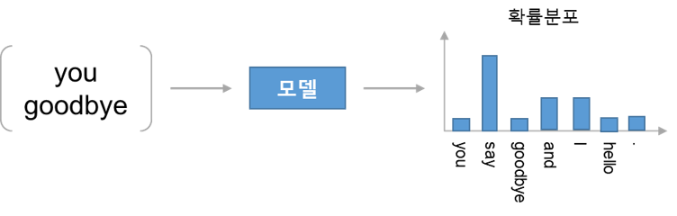
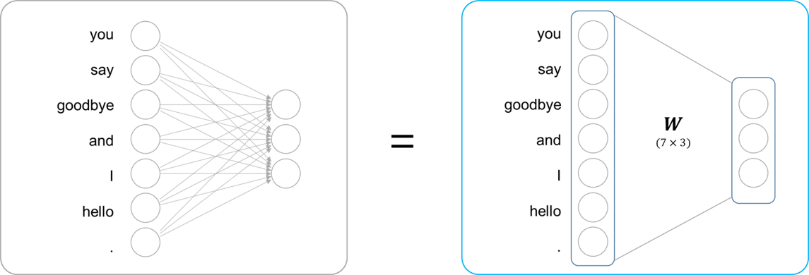
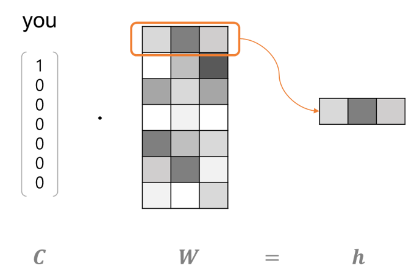

신경망을 이용해서 추론을 하는 기법 중 유명한 방식이 word2vec
이번 챕터에서는 처리 효율을 희생한 대신 이해하기 쉽도록 구성한 '단순한' word2vec를 설명

### 3.1 추론 기반 기법과 신경망

단어를 벡터로 표현하는 방법 중 성공적인 기법은 '통계 기반 기법'과 '추론 기반 기법'이며 단어의 의미를 얻는 방식은 서로 다르지만 배경에는 모두 분포 가설이 있다.

아래에서는 통계 기반 기법의 문제점과 추론 기반 기법의 이점을 거시적 관점에서 설명하고 word2vec의 전처리를 위해 신경망으로 '단어'를 처리하는 예시를 보여준다.

#### 3.1.1 통계 기반 기법의 문제점

통계 기반 기법에서는 단어의 동시 발생 행렬을 만들고 그 행렬에 SVD를 적용해서 밀집 벡터를 얻었는데 실제로 다루는 말뭉치의 어휘 수는 어마어마하기 때문에 대규모 말뭉치를 다룰 때 문제가 발생한다.

거대 행렬에 SVD를 적용하게 되면 SVD의 시간 복잡도는 O(n3)이므로 슈퍼컴퓨터로도 처리할 수 없는 연산을 해야 한다. 또한 말뭉치 전체의 통계를 이용해 1회의 처리로 단어의 분산 표현을 얻으므로 병렬 작업도 어렵다.

반면 추론 기반 기법 즉, 신경망을 이용하는 경우 미니배치로 학습하는 것이 일반적으로 소량의 학습 샘플에 대해 반복하여 가중치를 갱신하므로 여러 머신과 여러 GPU를 이용한 병렬 계산이 가능하여 학습 속도를 높일 수 있다.

#### 3.1.2 추론 기반 기법 개요

추론기반 기법에서는 아래 그림처럼 주변 단어가 주어졌을 때 "?"에 무슨 단어가 들어가는지를  추측하며 이러한 추론 문제를 반복해서 풀면서 단어의 출현 패턴을 학습한다.

말뭉치를 사용해 모델이 올바른 추측을 할 수 있도록 학습시키고 학습의 결과로 단어의 분산 표현을 얻는다.

통계 기반 기법처럼 '단어의의미는 주변 단어에 의해 형성된다'는 분포가설에 기초하며 두 기법 모두 분포 가설에 근거하는 '단어의 동시발생 가능성'을 얼마나 잘 모델링하는지가 중요하다.

#### 3.1.3 신경망에서의 단어 처리

신경망의 입력층에서 뉴런의 수를 **고정**하기 위해 단어를 **고정 길이 벡터**로 변환한다. 대표적인 기법으로 **원핫 벡터**를 사용 할 수 있다.

| 단어(텍스트) | 단어 ID | one-hot vector |
| ------------ | ------- | --------------------- |
| you | 0 | [1, 0, 0, 0, 0, 0, 0] |
| goodbye | 2 | [0, 0, 1, 0, 0, 0, 0] |

아래 그림의 신경망은 완전연결계층이므로 각각의 노드가 이웃 층의 모든 노드와 화살표로 연결되어 있다. 각 화살표에는 가중치가 존재하고 입력층 뉴런과의 가중합이 은닉층 뉴런이 된다. 편향을 고려하지 않은 완전연결계층은 **행렬 곱**으로 수행할 수 있다.

c는 원학 표현으로 단어 ID에 해당하는 원소만 1이고 그 외에는 0인 벡터이므로 c와 W의 행렬 곱은 아래 그림 처럼 가중치의 행벡터 하나를 뽑아낸 것과 같다.

가중치로부터 행벡터를 뽑아내기 위해 행렬 곱을 연산하는 건 비효율적이므로 다음장에서 개선 할 예정이다.

### 3.2 단순한 word2vec

#### 3.2.1 CBOW 모델의 추론 처리

#### 3.2.2 CBOW 모델의 학습

#### 3.2.3 word2vec의 가중치와 분산 표현

### 3.3 학습 데이터 준비

#### 3.3.1 맥락과 타깃

#### 3.3.2 원핫 표현으로 변환

### 3.4 CBOW 모델 구현

#### 3.4.1 학습 코드 구현

### 3.5 word2vec 보충

#### 3.5.1 CBOW 모델과 확률

#### 3.5.2 skip-gram 모델

#### 3.5.3 통계 기반 vs. 추론 기반

### 3.6 정리